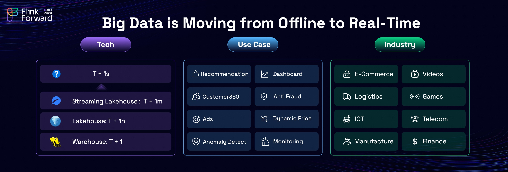

The industry is undergoing a clear and significant shift as big data computing transitions from offline to real-time processing.
This transition is revolutionizing various sectors, including the E-commerce, automotive networking, finance, and beyond,
where real-time data applications are becoming integral to operations. This evolution enables organizations to unlock greater
value by leveraging real-time insights to drive business impact and enhance decision-making.

<!-- truncate -->

The evolution of big data technology is becoming increasingly impactful, reshaping the computing architecture landscape.
The traditional Hive-based data warehouse has given way to modern architectures, starting with Lakehouse models and progressing
to the Paimon streaming Lakehouse, which has gained significant traction in markets like China and more recently started expanding to EU/US markets.
The core driver behind these architectural innovations is the need to improve data processing timeliness. The data freshness is improved from traditional
T+1 (next-day readiness) to T+1 hours, and now T+1 minutes. However, Lakehouse architectures, being file-system-based,
inherently face minute-level latency as their practical upper limit.

Yet, many critical use cases, such as search and recommendation systems, advertisement attribution, and anomaly detection, demand second-level latency.
While big data technologies have advanced significantly, there remains a notable gap: a user-friendly, second-level storage solution tailored for big data analytics.

In most real-time data scenarios, Apache Kafka has emerged as the go-to second-level storage solution. Its integration with Apache Flink represents the dominant architecture for building real-time data warehouses. However, while widely adopted, this combination presents significant challenges for achieving true real-time analytics at scale. The limitations of using Kafka for big data analytics highlight the need for a more robust solution to meet the demands of modern real-time use cases.

## Kafka Falls Short in Real-Time Analytics

### No Support for Updates

The first significant challenge with Apache Kafka is its lack of support for updates, a critical feature for data warehouses. In data warehousing, updates are often essential to correct or amend data. However, Kafka's inability to handle updates results in duplicate records for the same primary key. When consumed by a computing engine, this duplication necessitates costly deduplication processes to ensure accurate results.

In Apache Flink, for instance, handling this issue requires materializing all upstream data in state, which is resource-intensive. Every time data is consumed from Kafka, the deduplication process incurs a substantial overhead, significantly increasing computational and storage costs. This limitation not only impacts performance but also hampers the reusability of Kafka-stored data for downstream business processes.

### Lack of Querying Capabilities

The second major limitation of Apache Kafka is hard to debug, primarily due to its lack of native querying capabilities. In data warehousing, querying is a fundamental feature that facilitates troubleshooting and ad-hoc analysis to understand data trends. Unfortunately, Kafka operates much like a black box, making it challenging to perform these critical tasks without additional tools or layers.

To address this limitation, the industry has adopted two primary approaches, each with its own trade-offs:

- **Synchronizing Kafka Data to an OLAP System:** This allows for querying data using the OLAP system’s capabilities. However, this approach introduces additional components into the architecture, increasing both complexity and cost. Moreover, it risks data inconsistencies due to synchronization delays. 
- **Querying Kafka Directly Using Trino:** While Trino can query Kafka, it relies solely on full scans, which are inefficient for large-scale operations. For instance, a simple query on just 1GB of Kafka data can take up to one minute, rendering it impractical for large datasets or real-time requirements.

These limitations make Kafka unsuitable for efficient and scalable data exploration in modern data warehousing workflows.

### Difficulty with Data Backfilling

The third significant issue with Apache Kafka is processing historical data, also known as data backfilling, a common requirement in data warehousing.
For instance, in logistics, it usually needs to process and analyze historical data from several months ago. However, Kafka only retain data for a few days due to the high cost of storage.
Even though Kafka community has introduced [Tiered Storage](https://cwiki.apache.org/confluence/display/KAFKA/KIP-405%3A+Kafka+Tiered+Storage) to address the long-term data issue, it still has limitations.
Reading historical data still require all the data to pass through Kafka brokers, which can lead to brokers unstable and [disrupt live traffics](https://www.warpstream.com/blog/tiered-storage-wont-fix-kafka#increased-complexity-and-operational-burden).

These limitations highlight Kafka’s inefficiency as a solution for data backfilling in large-scale and long-term analytical use cases, further underscoring the need for more robust alternatives in real-time data warehousing.

### Excessive Network Costs
The final major challenge with Apache Kafka lies in its high network costs, which account for an estimated 88% of Kafka's overall operational expenses. In data warehousing, the "one write, multiple read" pattern is common, with each consumer often requiring only a subset of the data. However, Kafka's design mandates that consumers read the entire dataset, regardless of how much is actually needed.

For instance, among the tens of thousands of Flink SQL jobs at Alibaba, only 49% of the upstream columns are utilized per job on average. Despite this, consumers must read all the columns and pay 100% networking cost, which is highly inefficient and wasteful.

In summary, using Kafka for real-time analytics presents several critical issues: **(1) lack of support for updates**, **(2) absence of querying capabilities**, **(3) difficulty with data backfilling**, and **(4) excessive network costs**. These limitations make the combination of Flink and Kafka less than ideal for real-time data warehousing.
But why Kafka lacks these abilities? Is it possible to add the abilities to Kafka?

## Kafka is not designed for Analytics

The root cause of these challenges lies in the fundamental design philosophy of Kafka: **Kafka is designed for streaming events, NOT for streaming analytics**. Each system has its own focus and strengths, and Kafka's design is optimized for message queue scenarios rather than analytical workloads.

In Kafka, data is typically stored in a row-oriented format, such as CSV, JSON, or Avro.
While this is highly efficient for use cases involving message streaming, it becomes a bottleneck for analytical scenarios.
Data analysis requires handling large volumes of data, and therefore heavily relies on data skipping capabilities from storage, such as column pruning and predicate pushdown.
For this reason, columnar storage is far better suited for analytical workloads, whereas Kafka's row-based storage is not designed to meet these demands effectively.

## Introducing Fluss

When visualizing the data ecosystem as a four-quadrant matrix, an intriguing pattern emerges.
The left side of the matrix represents operational systems, while the right side represents analytical systems.
The top half is dedicated to stream storage, and the bottom half to table storage.
In operational systems, both databases and stream storage predominantly use row-based formats, as row storage is more efficient for transactional workloads. Conversely, in analytical systems like Apache Iceberg and Snowflake, columnar storage is preferred due to its superior performance in analytical scenarios.

Interestingly, the upper-right quadrant of the matrix remains empty, indicating a significant gap in the market: a streaming storage for analytical scenarios. Unsurprisingly, such a storage would likely adopt a columnar format to effectively address the needs of real-time analytics.

To fill the gap and resolve problems in Flink and streaming analytics, we embarked on a journey two years ago to create a streaming storage. We named the project "**FL**ink **U**nified **S**treaming **S**torage", and from its initials, we derived the name **Fluss**.

Interestingly, Flink is derived from the German word for "**agile**", and Fluss, which translates to "**river**" in German, resonates deeply with the project’s vision.
It symbolizes the streaming data is continuously flowing, distributing and converging into data lakes, just like a river.
The launch of Fluss coincides with Flink's 10th anniversary, making it a fitting tribute to the project’s heritage and its enduring contribution to the streaming data landscape.

Learn more details about Fluss in the next [blog post](/blog/fluss-intro/), where we will delve deeper into Fluss's architecture, design principles, key features, and explore how it addresses the challenges of using Kafka for real-time analytics.

