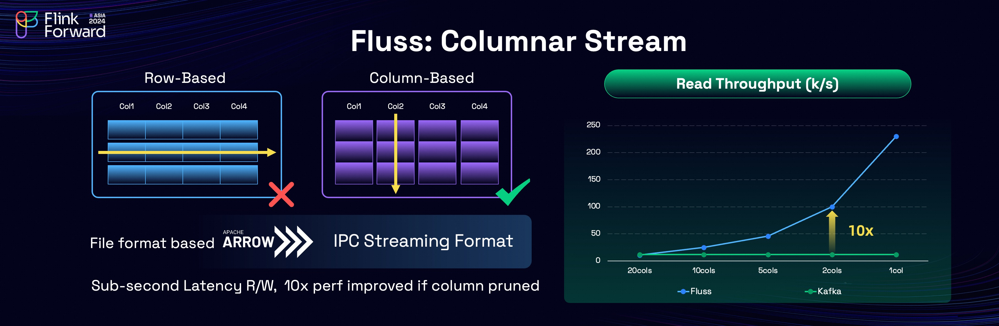
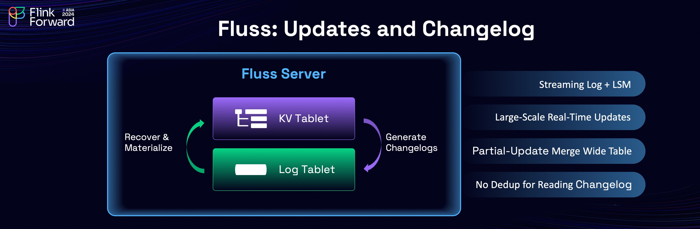
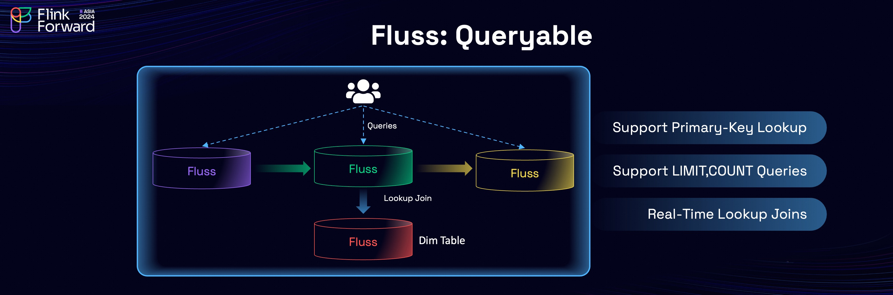
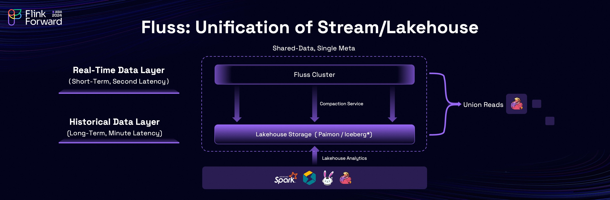
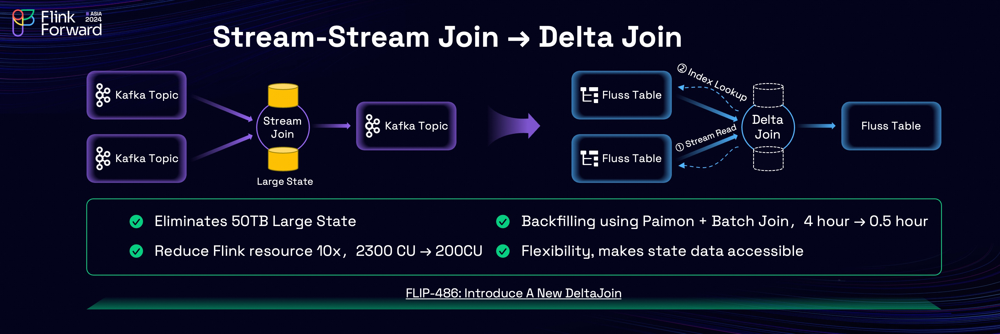
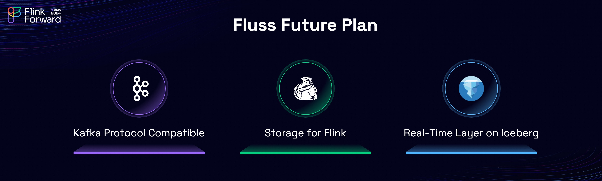

We have discussed the challenges of using Kafka for real-time analytics in our previous [blog post](/blog/why-fluss/).
Today, we are excited to introduce Fluss, a cutting-edge streaming storage system designed to power real-time analytics.
We are going to explore Fluss's architecture, design principles, key features, and how it addresses the challenges of using Kafka for real-time analytics.

<!-- truncate -->

## Key Features of Fluss

### Columnar Stream

Fluss is, as anticipated, is a columnar-based streaming storage, leveraging the [Apache Arrow IPC Streaming Format](https://arrow.apache.org/docs/python/ipc.html) for its underlying file storage.
This enables Fluss to achieve highly efficient column pruning while maintaining millisecond-level streaming reads and writes capabilities.

The performance benefits of Fluss are evident in its benchmarks against Kafka. In the comparison, the horizontal axis represents the number of columns read, while the vertical axis shows the read throughput. The results clearly demonstrate that Fluss's read performance scales proportionally with the reduction in columns read. For example, when the number of columns is reduced by 90%, Fluss achieves a 10x increase in read throughput.

A key advantage of Fluss is that column pruning is performed server-side and only the needed column data will be transferred to client-side. This architectural design not only enhances performance but also reduces network costs and resource consumption, making Fluss a highly efficient solution for real-time streaming analytics.

### Real-Time Updates and Changelog

Real-time updates and Changelog are very important features required by streaming analytics and Flink.
At its core, Fluss streaming storage is built on a Log Tablet, with a key-value (KV) index constructed over the Log.
The relationship between the Log and KV mirrors the concept of stream-table duality:
updates to the KV generate a changelog that is written to the Log. In the event of a failure, data from the Log is used to recover the KV.

The KV index is implemented as a Log-Structured Merge (LSM) tree to support large-scale real-time updates,
and also support partial-update which can be used to build wide table very efficiently. In addition, the changelog
generated by KV can be read directly by Flink without additional deduplication cost, which saves a lot of computing resources.

### Queryable

The built-in KV indexes enable high-performance primary key lookups, making Fluss suitable for real-time processing tasks such as dimension table joins. Users can also perform direct data exploration with Fluss, including queries with operations like LIMIT and COUNT, to make debugging data in Fluss very easy.

### Unification of Stream and Lakehouse

One of Fluss's standout features is the unification of stream and Lakehouse. In traditional Lambda architecture, you have to duplicate data in both real-time layer and batch layer. While Fluss eliminates this redundancy by unifying "data stored in stream" and "data stored in lake". This unification ensures consistent data and metadata while reducing storage costs and simplifying data workflows.

At its core, Fluss incorporates a `compaction service` that ensures seamless integration between stream and lake storage. This service automatically and continuously converts Fluss data into the data lake format.
A key feature here is called "Shared Data". The Lakehouse storage serves as the historical data layer for the streaming storage, which is optimized for storing long-term data with minute-level latencies. On the other hand, streaming storage serves as the real-time data layer for Lakehouse storage, which is optimized for storing short-term data with millisecond-level latencies.
The data is shared with each other, and is exposed as a singe table.
For streaming queries on the table, it firstly uses the Lakehouse storage as historical data to have efficient catch-up read performance, and then seamlessly transitions to the streaming storage for real-time data, ensuring no duplicate data is read.
For batch queries on the table, streaming storage supplements real-time data for Lakehouse storage, enabling second-level freshness for Lakehouse analytics.
This capability, termed **Union Read**, allows both layers to work in tandem for highly efficient and accurate data access.

In addition, the automatically converted data lake tables fully adhere to open table format protocols, ensuring compatibility with existing query engines such as Apache Spark, StarRocks, and Trino.
These engines can directly query data on Lakehouse storage, seamlessly integrating it into users' existing Lakehouse architectures.

Fluss has already completed integration with Apache Paimon, and integration with Apache Iceberg is underway. This commitment to compatibility ensures that Fluss remains a flexible and powerful component in the modern data stack, bridging real-time and historical data for unified analytics and storage efficiency.

## Overall Architecture

This is the overall architecture of Fluss, a cutting-edge streaming storage solution designed specifically for real-time analytics. Fluss operates a server cluster to provide high-performance real-time read and write capabilities, while leveraging remote storage for data tiering to optimize storage costs. Additionally, Fluss integrates seamlessly with Lakehouse architectures, enabling robust query capabilities and a unified data ecosystem.

The core features of Fluss include real-time streaming reads and writes, column pruning, streaming updates, changelog subscription, real-time lookup queries, and integration of stream and Lakehouse.

With its robust architecture and comprehensive feature set, Fluss empowers organizations to bridge the gap between real-time and historical data, enabling efficient, scalable, and cost-effective solutions for real-time analytics.

## Use Case: Delta Join

The combination of Fluss’s key features lends itself to a highly effective use case: Delta Join. Apache Flink provides a foundational feature called Stream-Stream Join, widely used for building wide tables. However, it is often one of the most challenging operations in Flink.
Stream-stream joins require maintaining the full upstream data in the state, leading to significant resource consumption. For instance, one of Taobao's largest Flink jobs is a stream-stream join (exposing associated orders), which needs to maintains a state of over 50 TB. This brings many challenges, such as high cost, unstable job, checkpoint timeout, slow restart recovery, etc.

To address these challenges, we developed a new Flink join operator implementation called Delta Join, leveraging Fluss’s streaming read and secondary-index lookup capabilities. Delta Join operates like a "bilateral driven lookup join", that is:
when data arrives from the left stream, the right table is queried using the join key;
when data arrives from the right stream, the left table is queried using the join key.
This approach eliminates state like Lookup Join, while preserving the semantics of a Stream-Stream Join (any updates on either side triggers an update to the join result).

We tested Taobao's largest stream-stream join job and migrated to delta join. The results were impressive:
- **Eliminate State:** Migrating from stream-stream join to delta join eliminated the need for `50 TB` join state, leading to enhanced job stability and avoid checkpoint timeouts.
- **Resource Optimization:** Flink resource cost decreased by 10x, dropping from `2300 CU` to `200 CU`, while maintaining the same throughput.
- **Faster Backfilling:** By leveraging Fluss’s Lakehouse integration, we can use the converted Paimon/Iceberg table and Sort-Merge Join in batch mode for data backfilling. Re-processing one day data was reduced from `4 hours` to `30 minutes`.

Besides the numbers, Delta Join's most significant benefit lies in its user flexibility.
Unlike traditional stream-stream joins, where the state is tightly coupled with Flink job, operating as an opaque 'black box', any job modification requires a costly and time-consuming state rebuild.
Delta Join addresses this by decoupling the state from the job, facilitating effortless job modifications without the need to reconstruct the state.
This separation not only boosts backfilling efficiency but also makes state data easily accessible in Fluss for analysis, thereby enhancing business agility and increasing developer productivity.

To formalize this innovation, we submitted the Delta Join [FLIP-486 proposal](https://cwiki.apache.org/confluence/display/FLINK/FLIP-486%3A+Introduce+A+New+DeltaJoin) to the Apache Flink community. We invite those interested to review and contribute to this exciting advancement.

Delta Join, powered by Fluss, represents a breakthrough in real-time analytics by significantly reducing resource consumption, enhancing performance, and unlocking flexibility in stateful stream processing.

## Future Plan

The future planning for Fluss involves three key aspects, each corresponding to its relationship with three open-source software projects:

- **Apache Kafka Protocol Compatibility:** This is aimed at helping existing streaming data migrate to Fluss more effectively.
- **Storage for Apache Flink:** Fluss aims to be the best storage for Apache Flink and streaming analytics, offering deep optimization with Flink across the storage, optimizer and execution layer. Delta Join marks our first major step, with many more exciting features on the way.
- **Real-Time Data Layer for Apache Iceberg:** By unifying stream and Lakehouse, Fluss is committed to providing a robust real-time data layer for Apache Iceberg and Apache Paimon. This vision includes creating a unified storage solution that supports both real-time and offline analytics.

There are more exciting work happening in the community. You can check out [Fluss Roadmap](/roadmap/) for a comprehensive future planning.
